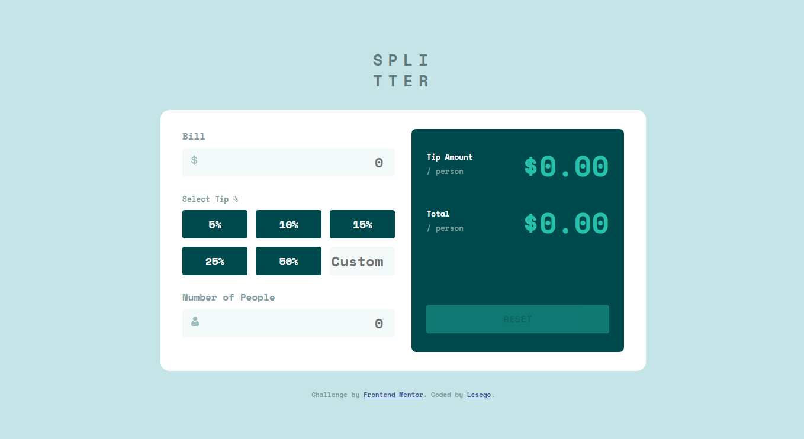

# Frontend Mentor - Tip calculator app solution

This is a solution to the [Tip calculator app challenge on Frontend Mentor](https://www.frontendmentor.io/challenges/tip-calculator-app-ugJNGbJUX). Frontend Mentor challenges help you improve your coding skills by building realistic projects.

## Table of contents

- [Overview](#overview)
  - [The challenge](#the-challenge)
  - [Screenshot](#screenshot)
  - [Links](#links)
- [My process](#my-process)
  - [Built with](#built-with)
  - [What I learned](#what-i-learned)
- [Author](#author)

## Overview

### The challenge

Users should be able to:

- View the optimal layout for the app depending on their device's screen size
- See hover states for all interactive elements on the page
- Calculate the correct tip and total cost of the bill per person

### Screenshot



### Links

- Solution URL: [https://github.com/lesego16/tip-calculator-app](https://github.com/lesego16/tip-calculator-app)
- Live Site URL: [https://lesego16.github.io/tip-calculator-app/](https://lesego16.github.io/tip-calculator-app/)

## My process

### Built with

- HTML5
- Flexbox
- CSS Grid
- Vanilla JavaScript

**Note: These are just examples. Delete this note and replace the list above with your own choices**

### What I learned

1.What I learned especially on the JavaScript part is being able to remove an active class on a button that was previously clicked.

2.I also learn how to iterate through item in an HTML document using a forEach loop

```js
function addActiveClass(e) {
  const isButton = e.target.nodeName === "INPUT";

  if (!isButton) {
    return;
  }

  e.target.classList.add("active");

  if (prevButton !== null) {
    prevButton.classList.remove("active");
  }

  prevButton = e.target;
}
```

```js
buttons.forEach((button) =>

);
```

## Author

- Frontend Mentor - [@lesego16](https://www.frontendmentor.io/profile/lesego16)
